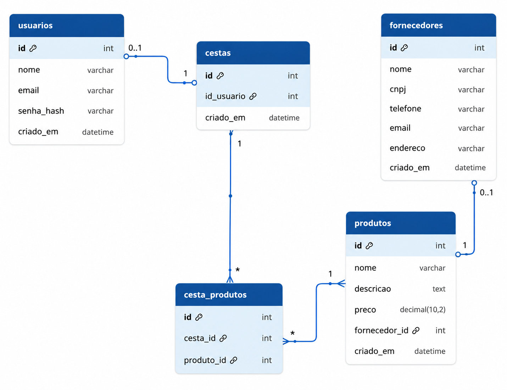

# Mini Sistema de Gestão de Produtos

Este projeto consiste em um mini sistema web para gestão de produtos, fornecedores e cestas de compras.  
O sistema foi desenvolvido como atividade acadêmica utilizando PHP, MySQL, PDO, HTML, CSS, JavaScript, Bootstrap e AJAX.

## Objetivo do Projeto

O objetivo do sistema é permitir que usuários autenticados possam cadastrar fornecedores, cadastrar produtos vinculados a fornecedores, criar cestas de compras e selecionar produtos para compor essas cestas.

O sistema utiliza conceitos de:

- Orientação a Objetos;
- Relacionamento entre objetos/classes;
- Armazenamento em banco de dados;
- Autenticação de usuários;
- Hash de senha;
- Requisições AJAX;
- Validação de dados;
- Organização em camadas.

## Tecnologias Utilizadas

- PHP
- MySQL
- PDO
- HTML5
- CSS3
- JavaScript
- AJAX
- Bootstrap 5
- XAMPP
- Git e GitHub

## Funcionalidades Implementadas

### Usuários

- Cadastro de usuários;
- Login de usuários;
- Autenticação por sessão;
- Logout;
- Armazenamento de senha com hash SHA-256.

As senhas dos usuários são armazenadas utilizando hash SHA-256, por meio da função:

```php
hash('sha256', $senha)
```

Dessa forma, a senha original não é gravada diretamente no banco de dados.

### Fornecedores

- Cadastro de fornecedores;
- Listagem de fornecedores;
- Edição de fornecedores;
- Exclusão de fornecedores;
- Atualização dinâmica dos dados utilizando AJAX.

### Produtos

- Cadastro de produtos;
- Listagem de produtos;
- Edição de produtos;
- Exclusão de produtos;
- Associação de cada produto a um fornecedor;
- Atualização dinâmica dos dados utilizando AJAX.

### Cestas

- Criação de cestas vinculadas ao usuário logado;
- Listagem das cestas criadas pelo usuário;
- Seleção de produtos por checkbox;
- Validação para impedir envio sem produtos selecionados;
- Inclusão de produtos na cesta;
- Visualização da cesta;
- Remoção de produtos da cesta;
- Exclusão de cestas;
- Exibição do resumo da cesta com:
  - total de produtos selecionados;
  - valor total dos produtos;
  - quantidade considerada como 1 unidade por produto;
- Atualização dinâmica dos dados da cesta utilizando AJAX.

## Regras do Sistema

- O usuário precisa estar autenticado para acessar as áreas internas do sistema.
- Cada cesta pertence ao usuário que a criou.
- Cada produto pertence a um fornecedor.
- Cada cesta pode possuir vários produtos.
- Cada produto selecionado é considerado como uma unidade.
- Não há campo para quantidade de produtos.
- O sistema valida se ao menos um produto foi selecionado antes de adicionar à cesta.

## Estrutura do Projeto

```text
mini-sistema-produtos/
│
├── actions/
│   ├── adicionar_produtos_cesta_action.php
│   ├── cadastro_usuario_action.php
│   ├── criar_cesta_action.php
│   ├── excluir_cesta_action.php
│   ├── fornecedor_action.php
│   ├── login_action.php
│   ├── logout_action.php
│   ├── produto_action.php
│   └── remover_produto_cesta_action.php
│
├── ajax/
│   ├── listar_fornecedores.php
│   ├── listar_cesta.php
│   └── listar_produtos.php
│
├── assets/
│   └── js/
│       ├── cesta.js
│       ├── fornecedores.js
│       ├── produtos.js
│       └── validacao_cesta.js
│
├── classes/
│   ├── Cesta.php
│   ├── Fornecedor.php
│   ├── Produto.php
│   └── Usuario.php
│
├── config/
│   └── database.php
│
├── includes/
│   └── auth.php
│
├── pages/
│   ├── cesta.php
│   ├── criar_cesta.php
│   ├── dashboard.php
│   ├── fornecedores.php
│   ├── minhas_cestas.php
│   ├── produtos.php
│   └── selecionar_produtos.php
│
├── index.php
├── login.php
├── cadastro.php
├── DER.png
└── README.md
```

## Banco de Dados

O sistema utiliza banco de dados MySQL com PDO.

O banco utilizado no projeto é:

```text
mini_sistema_produtos
```

A conexão está configurada no arquivo:

```text
config/database.php
```

Por padrão, o projeto está configurado para utilizar:

```text
Host: localhost
Porta: 3307
Usuário: root
Senha: vazia
Banco: mini_sistema_produtos
```

Caso a porta do MySQL seja diferente, altere o valor da propriedade `$port` no arquivo `config/database.php`.

## Criação Automática do Banco e das Tabelas

O sistema possui criação automática do banco de dados e das tabelas.

Ao instanciar a classe `Database`, o projeto executa automaticamente:

- criação do banco de dados, caso ele ainda não exista;
- conexão com o banco;
- criação das tabelas necessárias, caso elas ainda não existam.

As tabelas criadas são:

- `usuarios`
- `fornecedores`
- `produtos`
- `cestas`
- `cesta_produtos`

A criação é feita utilizando comandos como:

```sql
CREATE DATABASE IF NOT EXISTS mini_sistema_produtos;
```

e:

```sql
CREATE TABLE IF NOT EXISTS ...
```

## Relacionamentos do Banco de Dados

O sistema possui os seguintes relacionamentos:

### Usuários e Cestas

Um usuário pode possuir várias cestas.

```text
usuarios 1:N cestas
```

### Fornecedores e Produtos

Um fornecedor pode possuir vários produtos.

```text
fornecedores 1:N produtos
```

### Cestas e Produtos

Uma cesta pode possuir vários produtos, e um produto pode estar em várias cestas.

Esse relacionamento é feito por meio da tabela intermediária `cesta_produtos`.

```text
cestas N:N produtos
```

## Orientação a Objetos

O projeto utiliza classes para representar as principais entidades do sistema:

- `Usuario`
- `Fornecedor`
- `Produto`
- `Cesta`
- `Database`

Cada classe possui métodos responsáveis pelas operações relacionadas à sua entidade, como cadastro, listagem, edição, exclusão e busca de dados.

## AJAX

O sistema utiliza AJAX para atualização dinâmica de dados nas seguintes áreas:

- Fornecedores;
- Produtos;
- Cesta.

Com isso, parte das informações é atualizada sem necessidade de recarregar completamente a página.

## Telas do Sistema

O sistema possui as seguintes telas principais:

- Cadastro de usuário;
- Login;
- Dashboard;
- Cadastro e listagem de fornecedores;
- Cadastro e listagem de produtos;
- Criação de cesta;
- Seleção de produtos;
- Minhas cestas;
- Visualização da cesta.

## Esboços das Telas no Figma

Os esboços das telas foram desenvolvidos no Figma.

[Ver projeto no Figma](https://www.figma.com/design/9BFzxztHmO9kivJRWMCW3Z/mini-sistema-produtos?node-id=0-1&m=dev&t=17L6r5Y3N4GHQg1m-1)

## Diagrama Entidade Relacionamento

O Diagrama Entidade Relacionamento representa as tabelas e os relacionamentos do sistema.



## Como Executar o Projeto

### 1. Clonar o repositório

```bash
git clone https://github.com/aiolandap/mini-sistema-produtos.git
```

### 2. Acessar a pasta do projeto

```bash
cd mini-sistema-produtos
```

### 3. Colocar o projeto no XAMPP

Caso esteja utilizando XAMPP, coloque a pasta do projeto dentro de:

```text
C:/xampp/htdocs/
```

O caminho final deve ficar parecido com:

```text
C:/xampp/htdocs/mini-sistema-produtos/
```

### 4. Iniciar o Apache e o MySQL

Abra o painel do XAMPP e inicie:

- Apache;
- MySQL.

### 5. Conferir a porta do MySQL

O projeto está configurado para usar a porta:

```text
3307
```

Se o seu MySQL estiver usando a porta padrão:

```text
3306
```

altere no arquivo `config/database.php`:

```php
private string $port = "3307";
```

para:

```php
private string $port = "3306";
```

### 6. Acessar o sistema no navegador

```text
http://localhost/mini-sistema-produtos/
```

## Fluxo de Uso

1. Acessar o sistema;
2. Criar uma conta de usuário;
3. Fazer login;
4. Cadastrar fornecedores;
5. Cadastrar produtos vinculados aos fornecedores;
6. Criar uma cesta;
7. Selecionar produtos por checkbox;
8. Adicionar os produtos à cesta;
9. Visualizar a cesta;
10. Conferir o total de produtos e o valor total;
11. Remover produtos da cesta, se necessário;
12. Excluir cestas, se necessário.

## Boas Práticas Utilizadas

- Separação de responsabilidades em pastas;
- Uso de classes para representar entidades;
- Uso de PDO para conexão com o banco;
- Uso de prepared statements;
- Hash de senha;
- Autenticação por sessão;
- Validação de dados;
- Uso de AJAX para atualização dinâmica;
- Interface com Bootstrap;
- Navegação por menu/dashboard;
- Organização do código em arquivos específicos.

## Integrantes

| Nome | RA |
|---|---|
| Alessandra Iolanda Pacheco dos Santos | 60003882 |

## Observações

Este projeto foi desenvolvido para fins acadêmicos, com o objetivo de aplicar conceitos de orientação a objetos, banco de dados, autenticação, relacionamento entre entidades e atualização dinâmica de dados com AJAX.